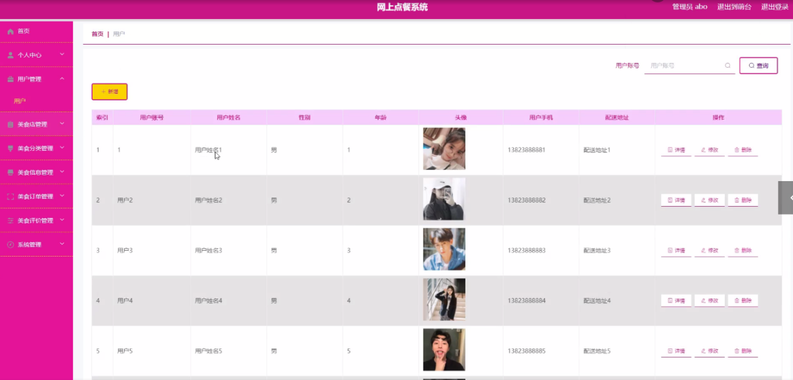
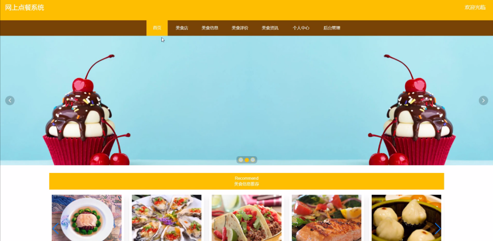
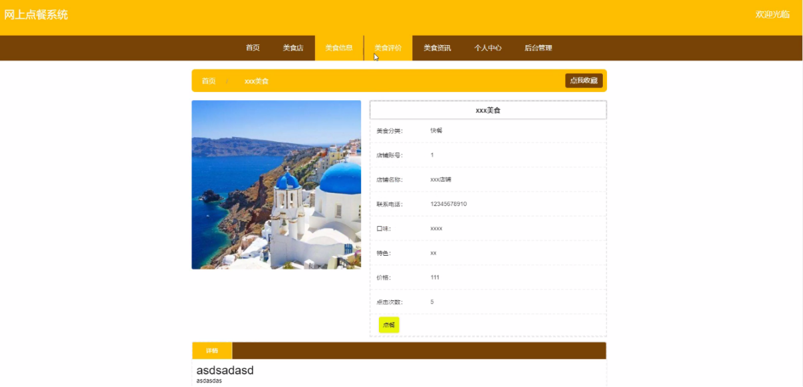
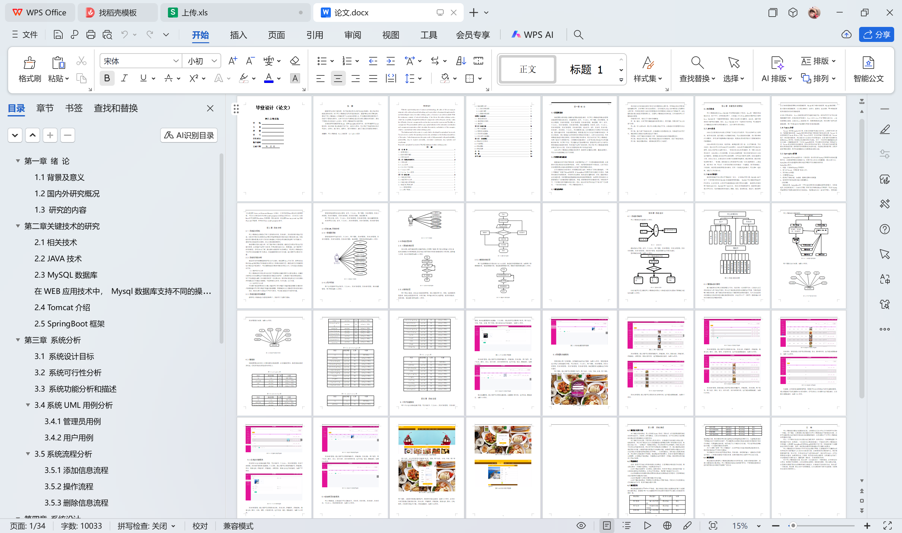

# springboot027-基于SpringBoot的网上点餐系统

>  博主介绍：
>  Hey，我是程序员Chaers，一个专注于计算机领域的程序员
>  十年大厂程序员全栈开发‍ 日常分享项目经验 解决技术难题与技术推荐 承接各类网站设计，小程序开发，毕设等。
>  【计算机专业课程设计，毕业设计项目，Java，微信小程序，安卓APP都可以做，不仅仅是计算机专业，其它专业都可以】

## 3000套系统可挑选，获取链接：https://chaerspol.github.io/

<b>QQ【获取完整源码】：674456564</b>

<b>QQ群【获取完整源码】：1058861570</b>

### 系统架构

> 前端：html | js | css | jquery | vue
>
> 后端：springboot | mybatis
> 
> 环境：jdk1.8+ | mysql | maven

# 一、内容包括
包括有  项目源码+项目论文+数据库源码+答辩ppt+远程调试成功

# 二、运行环境

> jdk版本：1.8 及以上； ide工具：IDEA； 数据库: mysql5.7及以上；编程语言: Java

# 三、需求分析

**3.1 系统设计目标**

网上点餐系统主要是为了用户方便对美食信息、美食评价、美食资讯等信息进行查询，也是为了更好的让管理员进行更好存储所有数据信息及快速方便的检索功能，对系统的各个模块是通过许多今天的发达系统做出合理的分析来确定考虑用户的可操作性，遵循开发的系统优化的原则，经过全面的调查和研究。
系统所要实现的功能分析，对于现在网络方便的管理，根据自己的需求可以进行查看信息等，这样既能节省用户的时间，不用在像传统的方式，需要查询、由于很多用户时间的原因，没有办法去了解，真的很难去满足用户的各种需求。所以网上点餐系统的开发不仅仅是能满足用户的需求，还能提高管理员的工作效率，减少原有不必要的工作量。

**3.2 系统可行性分析**

系统的开发环境和配置都是可以自行安装的，系统使用Java开发工具，使用比较成熟的Mysql数据库进行对系统前台及后台之间相关的数据交互，根据技术语言对数据库，结合需求进行修改维护，可以使得系统运行更具有稳定性和安全性，从而完成实现系统的开发。

（1）硬件可行性分析

网上点餐系统及信息分析的设计对于所使用的计算机没有什么硬性的要求，计算机只要可以正常的使用进行代码的编写及页面设计就可行，主要是对于服务器有些要求，对于平台搭建完成要上传的服务器是有一定的要求的，服务器必须选择安全性比较高的，然后就是在打开系统必须顺畅，不能停顿太长时间；性价比高；安全性高。

（2）软件可行性分析

开发整个系统使用的是云计算，流量的可扩展性和基于流量的智能调整云计算的优点就是流量的可扩展性和基于流量的智能调整，保障系统的安全及数据信息的及时备份。
因此，我们从两个方面进行了可行性研究，可以看出系统的开发没有问题。

**3.3 系统功能分析和描述**

使用网上点餐系统分为管理员和用户、美食店三个权限子模块。

管理员所能使用的功能主要有：首页、个人中心、用户管理、美食店管理、美食分类管理、美食信息管理、美食订单管理、美食评价管理、系统管理等。

用户可以实现；首页、个人中心、美食订单管理、美食评价管理、我的收藏管理等。

美食店可以实现；首页、个人中心、美食信息管理、美食订单管理、美食评价管理等。

# 四、功能模块
此系统功能较为全面如下图系统功能结构如图
 

# 五、部分效果图展示

图5-1个人信息界面图【用户点击进入到系统操作界面，可以对首页、个人中心、美食订单管理、美食评价管理、我的收藏管理等功能模块，个人信息：通过列表可以获取用户账号、用户姓名、性别、年龄、头像、用户手机、配送地址并进行修改操作，如图】

图5-2美食评价管理界面图【美食评价管理：通过列表可以获取店铺账号、店铺名称、美食名称、用户账号、用户姓名、图片、评分、评价内容、评价时间等信息，进行详情、修改、删除操作，如图】

图5-3我的收藏管理界面图【我的收藏管理：通过列表可以获取收藏名称、收藏图片等信息，进行详情、删除操作，如图】

图5-4管理员登录页面【管理员通过用户名和密码、角色填写完成后进行登录】

图5-5用户管理页面【用户管理：通过列表可以获取用户账号、用户姓名、性别、年龄、头像、用户手机、配送地址等内容，可以进行修改或删除操作】

图5-6前台首页功能界面图【网上点餐系统，在系统首页可以查看首页、美食店、美食信息、美食评价、美食资讯、个人中心、后台管理等内容，如图】

图5-7美食信息界面图【在美食信息页面通过查看美食名称、美食分类、店铺账号、店铺名称、联系电话、图片、口味、特色、价格等信息进行点餐、点我收藏操作，如图】

 <b>完整文章</b>
 

 

## 3000套系统可挑选，获取链接：https://chaerspol.github.io/

<b>QQ【获取完整源码】：674456564</b>

<b>QQ群【获取完整源码】：1058861570</b>

